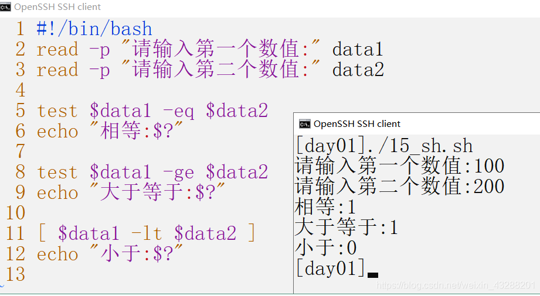
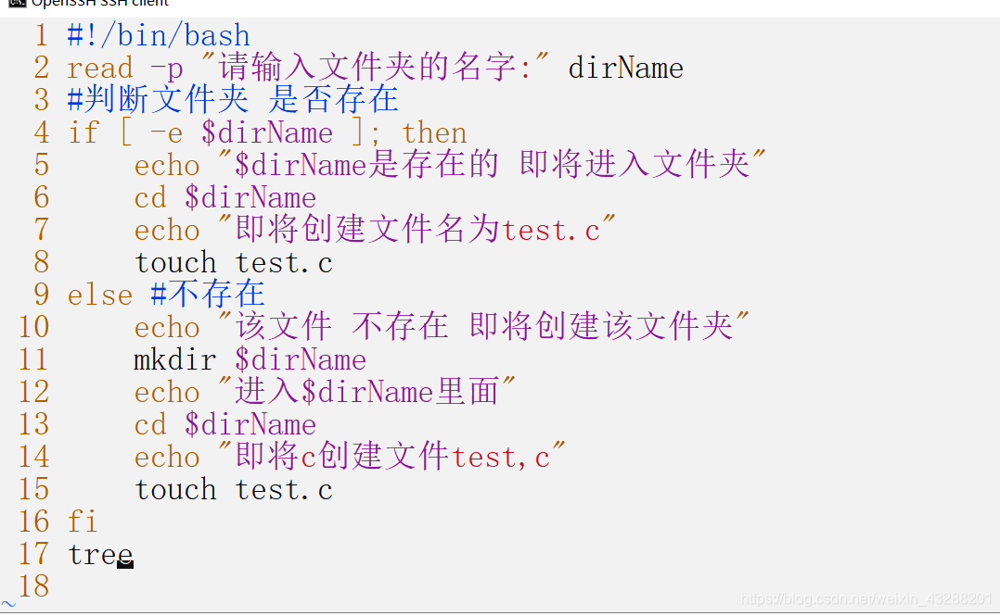

#Shell脚本

## 1.shell概述

shell 是一种脚本语言

- 脚本：本质是一个文件，文件里面存放的是 特定格式的指令，系统可以使用脚本解析器 翻译或解析 指令 并执行（它不需要编译）
shell 既是应用程序 又是一种脚本语言（应用程序 解析 脚本语言）

- shell命令解析器：
系统提供 shell命令解析器： sh ash bash
查看自己linux系统的默认解析：echo $SHELL

## 2.shell脚本的调用形式
**打开终端时系统自动调用：/etc/profile 或 ~/.bashrc**

/etc/profile
此文件为系统的每个用户设置环境信息,当用户第一次登录时,该文件被执行，系统的公共环境变量在这里设置
开始自启动的程序，一般也在这里设置
~/.bashrc
用户自己的家目录中的.bashrc
登录时会自动调用，打开任意终端时也会自动调用
这个文件一般设置与个人用户有关的环境变量，如交叉编译器的路径等等
用户手动调用：用户实现的脚本

## 3.shell语法初识
### 3.1、定义以开头：#!/bin/bash
用来声明脚本由什么shell解释，否则使用默认shell
```shell script
#!/bin/bash
```
### 3.2、单个"#"号代表注释当前行
1.第一步：编写脚本文件
```shell script
#!/bin/bash

#注释
```
2.第二步：加上可执行权限
chmod +x xxxx.sh
```shell script
#!/bin/bash

#注释

chmod +x myshell.sh
echo "test.sh"
```
3.第三步：运行

运行的三种方式：

3.2.1 ./myshell.sh
:先按照 文件中#!指定的解析器解析
如果#！指定指定的解析器不存在 才会使用系统默认的解析器

3.2.2 .myshell.sh
直接使用默认解析器解析（不会执行第一行的#！指定的解析器）但是第一行还是要写的

3.2.3 bash myshell.sh
bash xxx.sh:指明先用bash解析器解析
如果bash不存在 才会使用默认解析器

##4 变量
###4.1 定义变量
定义变量
变量名=变量值
如：num=10

引用变量
$变量名

unset ：清除变量值

示例
```shell script
#!/bin/bash
#注释
chmod +x myshell.sh

num = 10 
echo $num
unset num
echo num
```
###从键盘读取变量 read
1. 示例：
```shell script
#!/bin/bash
#注释
chmod +x myshell.sh
num = 10
echo $num
read num
echo $num
```
2.注意：在一行上显示和添加提示 需要加上-p
示例：
```shell script
#!/bin/bash
#注释
chmod +x myshell.sh
num = 10
echo $num
read -p "请输入变量num" num
echo $num
```
3.一次读取多个值
示例：
```shell script
#!/bin/base
#注释
chmod +x myshell.sh

read data1 data2
echo "data1 = $data1"
echo "data2 = $data2"

```
4.只读变量 readonly

```shell script
#!/bin/base
#只读变量
readonly num = 100
echo "num = $num"
num = 200
echo "num = $num"
```

###5.查看环境变量 env
(1).示例: 
```shell script
#!/bin/base
#只读变量
env
```
(2).导出环境变量
作用：（让其他shell脚本识别该变量，设为全局变量）

(3).source脚本
- source 命令用法： source FileName
- 作用:在当前bash环境下读取并执行FileName中的命令。
- 注:该命令通常用命令“.”来替代。
如:source .bash_rc 与 . .bash_rc 是等效的。
- 注意:source命令与shell scripts的区别是，
source在当前bash环境下执行命令，而scripts是启动一个子shell来执行命令。这样如果把设置环境变量(或alias等等)的命令写进scripts中，就只会影响子shell,无法改变当前的BASH,所以通过文件(命令列)设置环境变量时，要用source 命令。

例：myshell.sh
```shell script
#!/bin/base
#只读变量
export DATA = 250
```
执行文件
```shell script
source myshell.sh
echo $DATA 
```
###6.命名注意事项
- 1、变量名不能以数字开头

1_num=10 错误

num_1=20 正确
- 2、等号两边不能直接接空格符，若变量中本身就包含了空格，则整个字符串都要用双引号、或单引号括起来
- 3、双引号 单引号的区别

双引号：可以解析变量的值

单引号：不能解析变量的值

例：
```shell script
#!/bin/base
num=200
echo "num = $num"
echo 'num = $num'
```

执行结果
```shell script
num = 200
num = $num
```
###7.预设变量
shell直接提供无需定义的变量
- $#: 传给shell脚本参数的数量
- $*: 传给shell脚本参数的内容
- $1,$2,$3,$4...$9: 运行脚本时传递给其的参数，用空格隔开
- $? 命令执行后返回的状态。$? 命令用于检查上一个命令执行是否正确（在linux 中，命令退出状态为0表示该命令正确执行，任何非0值表示命令出错）
- $0 当前执行的进程名
- $$ 当前进程的进程号 $$变量最常见的用途是作零时文件的名字以保证零时文件不重复

例： myshell.sh
```shell script
#!/bin/bash
#预设变量
echo "$#"
echo "$*"
echo "$1"
echo "$2"
echo "$3"
readonly num=250
echo"readonly num=250 命令执行结果是：$?"
echo "进程名：$0"
echo "进程号：$$"

```
执行：
```shell script
./myshell.sh 1 2 3 4  
```

执行结果： 
```
4
1 2 3 4
1
2
3
readonly num=250 命令执行结果是：0
进程名：./test.sh
进程号：6249
```
###8.脚本标量的特殊用法
- "" : 包含的变量会被解释
- '' : 全部是字符串，不解释变量
- `` : 反引号中的内容作为系统命令，并执行其内容，可以替换输出为一个变量
例：
```shell script
echo "tody id `date`"
```
执行结果
```shell script
tody is Thu Nov 11 17:04:25 CST 2021
```
- \ 转义符
同c语言 \n \r \t \a等，echo命令需要加 -e 转义

例：
```shell script
echo "##\n##"
echo -e "##\n##"
```
执行结果:
```shell script
##\n##
##
##
```

- ():中的代码块将由子shell进行，不会影响当前shell
例：
```shell script
#!/bin/base
# ()
data=10
(# 子shell完成，不会影响shell的值
data=100
echo "()里边的data = $data"
)
echo "() 外边的data = $data"
```
执行结果
```shell script
()里边的data = 100
() 外边的data = 10
```

- {}中的代码块由当前shell执行，会影响当前shell
```shell script
#!/bin/base
# ()
data=10
{# 子shell完成，不会影响shell的值
data=100
echo "()里边的data = $data"
}
echo "() 外边的data = $data"
```

执行结果
```shell script
()里边的data = 100
() 外边的data = 100
```
###9.变量的扩展
####9.1判断变量是否存在 
${num:-val} 如果变量存在，整个表达式的值为num，否则为val
```shell script
#!/bin/bash
#${num:-val} 如果变量存在，整个表达式的值为num，否则为val
echo ${num:-100}
num=200
echo ${num:-100}
``` 
执行结果：
```shell script
100
200
```
###9.2字符串操作
- ${#str} 测量字符串长度
- ${str:3} 从字符串下标为3的位置开始截取
- ${str:3:6} 从字符串下标为3开始截取6位
- ${str/old/new} 用new替换str中的第一个old
- ${str//old/new} 用new替换str中的所有old

###10.条件测试
####10.1test命令
1. test命令：用于测试字符串，文件状态和数字
2. test命令的两种格式：
- test condition
- [ condition ] 使用方括号时没注意在条件两边加上空格
####10.2 文件测试
测试文件状态的条件表达式：
- -e 是否存在
- -d 是目录
- -f 是文件
- -r 可读
- -w 可写
- -x 可执行
- -L 符号链接
- -c 是否字符设备
- -b 是否块设备
- -s 文件非空
####10.3字符串测试
- = 两个字符串相等
- != 两个字符串不相等
- -z 空串
- -n 非空串
```shell script
test str = "str"

```
####10.4数值测试
- -eq 数值相等
- -ne 数值不相等
- -gt 数1大于数2
- -ge 数1大于等于数2
- -lt 数1小于数2
- -le 数1小于等于数2


###11 符合语句测试
####11.1
- && 左边命令执行成功(即返回0) shell才执行右边的命令
- || 坐便命令未执行成功(即返回非0) shell才执行右边命令
例：
```shell script
test -e /home && test -d /home && echo "true"
```
####11.2 多重条件判定
- a 两个状况同时成立返回true
- o 两个状况任何一个成立返回true
- ! 取反

###12控制语句
####12.1 if语句
- if [ 条件1 ]; then else fi
- if [ 条件1 ]; then elif [条件2]; then fi

例 1：
```shell script
#!/bin/base
#控制语句
read -p "请输入y：" y
if [ $y="y" ]; then
echo "y"
elif [ $y="h" ]; then
echo "h"
else 
echo "end"
fi  
```
例2：

####12.2 case语句
- 语法格式
```shell script
case $变量名 in
    "第一个变量内容"）
    程序段1
    ;;
    "第二变量内容" )
    程序段2
    ;;
    *)
    其他程序段
    exit 1
esac
```
- 例：
```shell script
!#/bin/bash
read -p "请输入yes/on:" choice
case $choice in
    yes | y* | Y*)
    echo "yes"
    ;;
    no | n* |N*)
    echo "no"
    ;;
    *)
    echo "other"
    ;;
esac
```
####12.3 for 循环语句
- 注意： declare 是bash内建命令，可以用来声明shell变量，设置变量的属性。declare也可以写作typeset。<br/>
declare -i s 代表强制把变量s当做int型参数运算。

- 形式1 <br/>
for((初始值; 限制值; 步长))
    do
        程序段
    done
<br/>
例：
```shell script
#!/bin/bash
#显示使用declare执行为int类型
declare -i sum=0
declare -i i=0
for (( i = 0; i < 100; i++ ))
do
  sum=$sum+$i    
done
echo "sum=$sum"
```

- 形式2
for var in col1 con2 con3...
do
    程序段
done
<br/>
例：
```shell script
#!/bin/bash
#显示使用declare执行为int类型
declare -i sum=0
declare -i i=0
for i in 1 2 3 4 5 6  
do
  sum=$sum+$i    
done
echo "sum=$sum"
```
####12.4 while循环
形式：
while [ condition ]
do
    程序段
done
<br/>
例：
```shell script
#!/bin/bash
#while循环
declare -i i
declare -i s
while [ "$i"!="101" ]
do
  s+=i;
  i=i+1;    
done
echo "$s"
```
####12.5 until循环
- 形式：
until [ condition ]
do 
    程序段
done
<br/>
这种方式与while方式相反，当condition成立时退出循环，否则继续循环
<br/>
例：
```shell script
#!/bin/bash
declare -i i
declare -i s
until [ "$i"="100" ]
do
  s+=i;
  i=i+1;    
done
echo "$s"
```

####12.6 break continue
- break 跳出循环体
- continue 跳过本次循环

###13 定义函数的两种格式
####格式1:
f(){
命令 ...
}
####格式2：
function f(){
命令...
}
####函数调用形式：
函数名 pam1 pam2......
####函数返回值
return 从函数中返回，用最后状态命令决定返回值。
return 0 无措返回
return 1 有错返回

##补充指令
####awk指令
[awk命令](awk.md)
####xargs
[xargs命令](xargs.md)

#案例
##1 java 项目启动脚本
project.sh
```shell script
#!/bin/bash
#java项目启动脚本
chmod +x $0
SHELL_FOLDER=`dirname $0`
PROJECT_NAME="farm-plus-manager-0.0.1-SNAPSHOT.jar"
LOG_PATH=$SHELL_FOLDER/logs
JAVA_OPTS="
-Xms1280M 
-Xmx1280M 
-Dfile.encoding=utf-8"

start(){
#nohup java args -jar xxxx.jar > xxx.log 2>&1 &
if [ ! -d $LOG_PATH ];then
  mkdir $LOG_PATH
fi       
nohup java $JAVA_OPTS -jar $SHELL_FOLDER/$PROJECT_NAME > $LOG_PATH/manager.log 2>&1 &
echo "project start $JAVA_OPTS" 
}       
stop(){
ps -ef | grep $SHELL_FOLDER/$PROJECT_NAME | grep -v grep | awk '{print $2}'|xargs kill -9
echo "project stop"
}
restart(){
stop
start
}
case $1 in
    "start")
    start
    ;; 
    "stop")
    stop
    ;;
    "restart")
    restart
    ;;
    *)
    echo "fail"
esac
```


 


